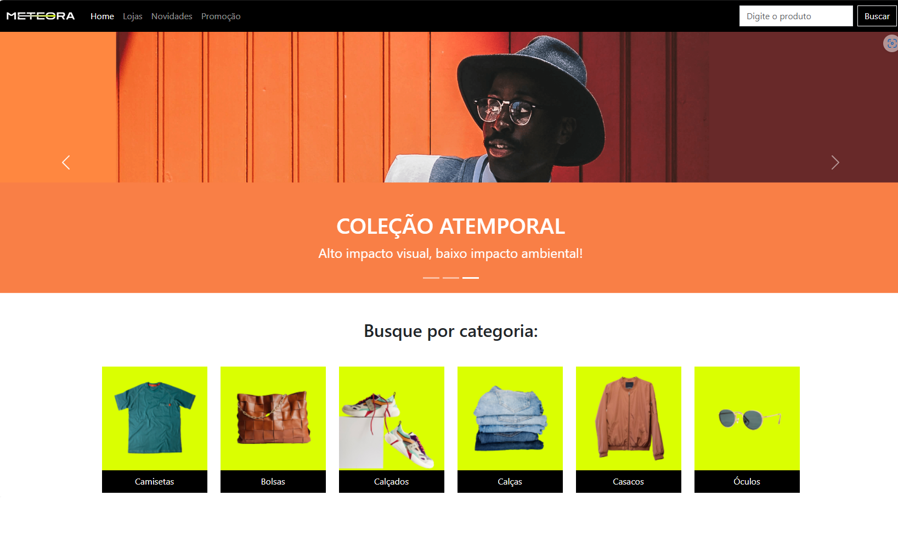

# Meteora

O Meteora é uma loja de roupas. Atualmente, temos o código inicial de sua landing page, onde iremos atualizando conforme promoções.

## 🔨 Funcionalidades do projeto

Temos um projeto que foi idealizada com o objetivo de uma apresentação de uma landing page de um loja de roupas, com preços e promoções.  
O [Figma](https://www.figma.com/design/TT8Uq6LmVELALMKs4G4HE2/Meteora---Projeto-Bootstrap-5?node-id=2386-2430&t=jZw8gXuJs2JrIjk6-0) para versões mobile, tablet e desktop.

## ✔️ Técnicas e tecnologias utilizadas

-`HTML`
-`CSS`
-`Bootstrap`
-`Acessibilidade Web`
-`Figma`

## 🛠️ Abrir e rodar o projeto

Para abrir e rodar o projeto, utilize um editor de código de sua escolha.
Depois, abra o projeto no seu navegador.

## 📚 Mais informações

O Meteora é uma empresa fictícia utilizada para aperfeiçoar as habilidades.
A ideia principal desse projeto é evoluir ainda mais os conhecimentos em HTML e CSS e principalmente focado em bootstrap.

## VERCEL 
https://meteora-mu-three.vercel.app/
